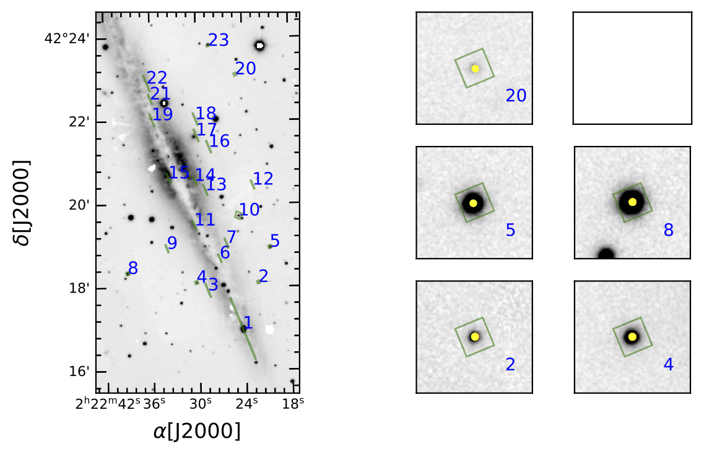

Output
===========

tilsotua Output Files
-----------------------------
tilsotua writes multiple output files while running :doc:`xytowcs`.

A FITS files in the structure of the UCO/Lick mask archive files with slit sky coordinates
filled in the appropriate extension.

A PDF of the 'Quick-look' plot showing the mask on the g-band PanSTARRS image of the field. Cutouts
panels for 6 alignment boxes are also included for ease of checking final mask alignment.
Catalog objects associated with with the alignment boxes are marked in yellow.

A CSV file containing the original coordinates of the slit corners in the mask coordinate frame,
the calculated sky positions of the slit corners, the slit center positions in both coordinate frames,
and the coordinates of the Gaia catalog objects selected to go in the alignment boxes (zeros are recorded for non alignment box slits).

DS9 region file of the slit positions.
